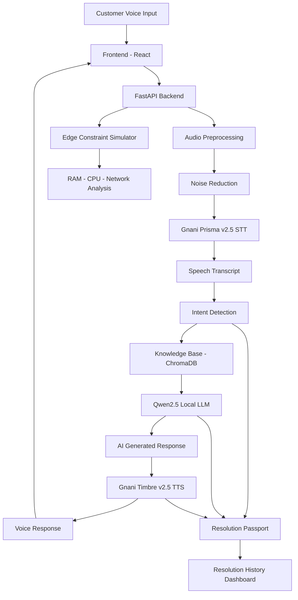

# VaaniSetu Edge – System Architecture

## Overall Architecture

```mermaid
flowchart TD
    A[Customer Voice Input] --> B[Frontend - React]
    B --> C[FastAPI Backend]

    C --> D[Audio Preprocessing]
    D --> E[Noise Reduction]
    E --> F[Gnani Prisma v2.5 STT]

    F --> G[Speech Transcript]
    G --> H[Intent Detection]

    H --> I[Knowledge Base - ChromaDB]
    I --> J[Qwen2.5 Local LLM]

    J --> K[AI Generated Response]
    K --> L[Gnani Timbre v2.5 TTS]

    L --> M[Voice Response]
    M --> B

    H --> N[Resolution Passport]
    J --> N
    L --> N

    C --> O[Edge Constraint Simulator]
    O --> P[RAM - CPU - Network Analysis]

    N --> Q[Resolution History Dashboard]
```
